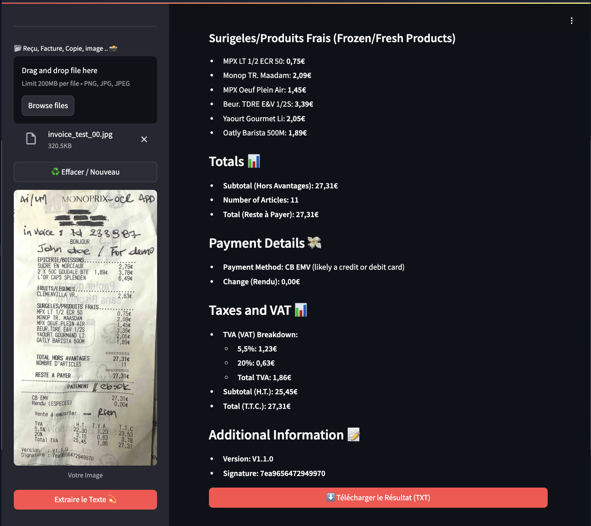

# 🧾 OCR AI App – Text Extraction from Images using Groq Vision LLM

A simple yet powerful web app to extract structured text from images using the **Groq Vision LLM** (Llama 4 Scout : `meta-llama/llama-4-scout-17b-16e-instruct`). Built with **Streamlit**, this tool supports image formats like JPG, PNG, and JPEG, and allows users to download or view extracted content in Markdown format.



---

## 🔍 Features

- Upload any image (receipts, invoices, documents, etc.)
- Extract readable text using Groq’s Vision-capable LLM
- View results directly in the browser
- Download extracted text as `.txt` file
- Clean, responsive UI with Streamlit
- Uses `st.secrets` for secure API key handling


# Use-cases : 
- Extracting text from receipts and invoices
- Digitizing handwritten notes
- Converting printed material into editable text
- Automating data entry tasks


## 🚀 Technologies Used

- [Streamlit](https://streamlit.io) – For building the web interface
- [Groq Python SDK](https://github.com/groq/groq-python) – For interacting with Groq Vision LLM
- [Pillow (PIL)](https://pillow.readthedocs.io/) – For image processing
- [Base64](https://docs.python.org/3/library/base64.html) – For encoding images


## 📦 Prerequisites

Before running the app, make sure you have:

- Python 3.10+
- A Groq account with an API key (get it at [https://console.groq.com/keys](https://console.groq.com/keys))
- The following Python packages installed:

  ```bash
  pip install streamlit groq pillow
  ```

## 🛠️ Setup Instructions

1. Clone this repository:
```bash
git clone https://github.com/your-username/ocr-ai-app.git
cd ocr-ai-app
```
  
2. Create a .streamlit/secrets.toml file with your Groq API key:
```bash
GROQ_API_KEY = "your-groq-api-key-here"
```

3. Run the app :
```bash
streamlit run app.py
```

## 🛠️ Project Structure :

```bash
ocr-ai-app/
├── app.py                  # Main application code
├── .streamlit/
│   └── secrets.toml        # Local secret storage
└── README.md               # This file
```
